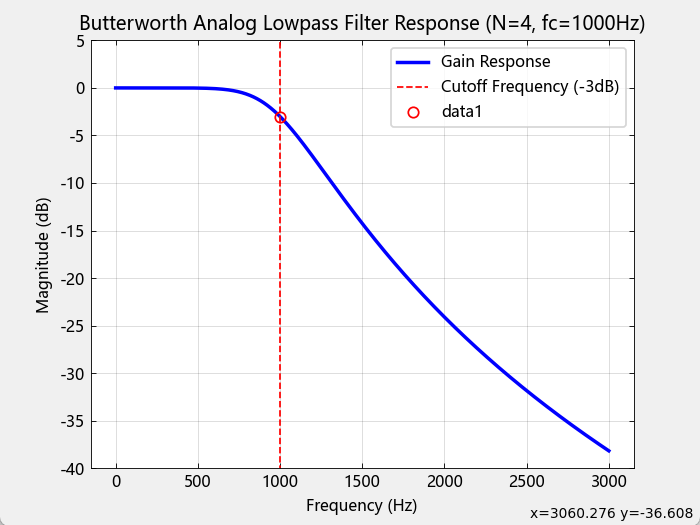
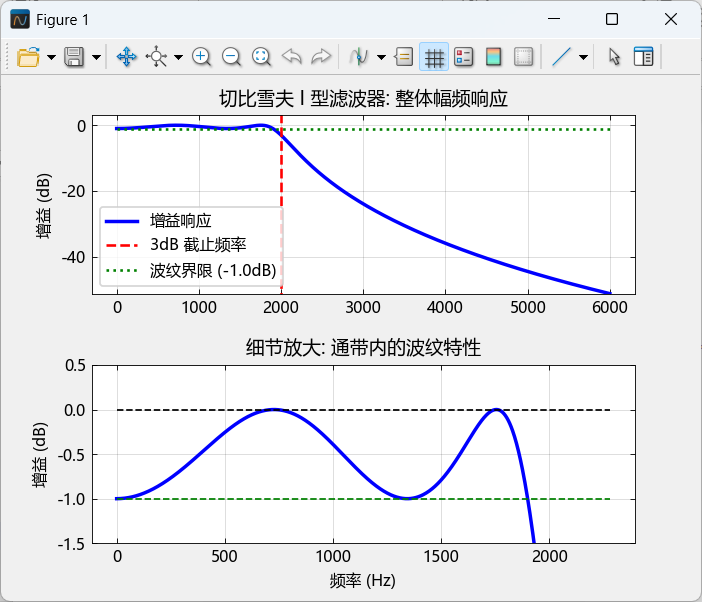
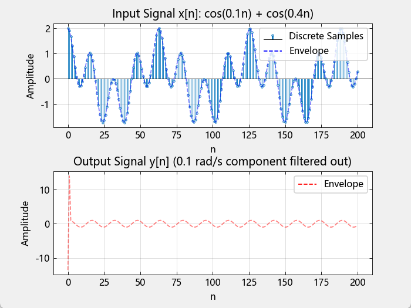

<div align="center"><h1>DSP上机实验 MATLAB+MWORKS</h1></div>

> 感谢lsc,yxy.hyf完成本报告的代码部分

# DSP 上机实验（MATLAB / MWorks / Julia）

本项目包含《数字信号处理》上机实验的 40 道题目，分别用 MATLAB 和 MWorks（基于 Julia 的科学计算环境）实现。每个题目都附有源代码、运行结果图以及详细的说明文档。

## 📁 项目结构

```txt
DSP上机实验/
│ README.md # 本文件
│ Readme.pdf # PDF 版本说明
│
├─Bitmap/ # 运行结果图（MATLAB 与 MWorks 对比）
│ MATLAB01.png
│ MWORKS01.png
│ ...
│
├─MATLAB/ # MATLAB 版本代码
│ ├─Src/ # 各题源代码（.m 文件）
│ └─参考报告/ # 实验报告与汇总文档
│ Matlab.md
│ matlab上机完美版 11通信修订版.doc
│
└─MWorks/ # MWorks/Julia 版本代码
│ DSP上机40题(Mworks).md # 汇总所有 Julia 代码
│ DSP上机40题(Mworks).pdf
│
└─src/ # 各题源代码（.jl 文件）
```


## 📚 实验题目列表

### 1. 滤波器设计与群延时均衡
- 椭圆 IIR 低通 + 全通群延时均衡（3阶/6阶）
- 巴特沃兹、切比雪夫、椭圆滤波器设计（低通、高通、带通）
- Kaiser 窗、海明窗 FIR 滤波器设计
- 多频带 FIR 滤波器设计

### 2. 系统分析与变换
- 部分分式展开
- 系统稳定性分析
- 零极点分布图绘制
- 级联型、并联型结构分解
- 格型结构系数计算

### 3. 信号处理与滤波
- 滑动平均滤波器
- 中值滤波器
- 重叠相加法滤波
- 总体均值滤波器

### 4. 变换与频谱分析
- 离散傅立叶变换（DFT）
- 离散时间傅立叶变换（DTFT）
- 复指数序列绘制
- 卷积计算（时域与频域）

### 5. 信号生成与处理
- 指数序列、矩形序列生成
- 加性噪声模拟
- 包络分析
- 频响特性绘制

## 🛠️ 环境要求

### MATLAB 版本
- MATLAB R2016b 或更高版本
- 需安装 Signal Processing Toolbox

### MWorks / Julia 版本
- [MWorks](https://mworks.systems/) 或 Julia 1.6+
- 需安装以下 Julia 包：
  - `DSP`
  - `TyPlot`（MWorks 内置）
  - `FFTW`
  - `Optim`
  - `LinearAlgebra`
  - `Statistics`
  - `Polynomials`
  - `SymPy`

## 🚀 使用说明

### MATLAB
1. 进入 `MATLAB/Src/` 目录
2. 运行对应的 `.m` 文件，如 `Question1.m`
3. 结果将显示在图形窗口，部分结果输出到命令窗口

### MWorks / Julia
1. 进入 `MWorks/src/` 目录
2. 使用 MWorks 或 Julia 运行对应的 `.jl` 文件，如 `Q1.jl`
3. 或直接打开 `DSP上机40题(Mworks).md` 在 MWorks 中逐题运行

## 📊 结果对比

`Bitmap/` 目录下包含了 MATLAB 与 MWorks 运行结果的截图，可用于对比验证两种实现方式的一致性。

## 📄 文档说明

- `Matlab.md`：MATLAB 所有题目的代码汇总与说明
- `DSP上机40题(Mworks).md`：MWorks/Julia 所有题目的代码汇总与说明
- `matlab上机完美版 11通信修订版.doc`：详细的实验报告与题目解析

## 🧪 实验特点

- 每题均提供 MATLAB 与 MWorks/Julia 双版本实现
- 代码注释详细，便于理解数字信号处理的基本原理
- 包含滤波器设计、系统分析、信号处理等多个 DSP 核心主题
- 可直接用于教学、实验或自学参考

## 📄 许可证

本项目仅供学习交流使用，遵循 MIT 许可证。请勿用于商业用途。

## 🙏 致谢

感谢数字信号处理课程教师与同学们的贡献，以及 MATLAB 与 Julia 开源社区的支持。

---

**如果本项目对你有帮助，欢迎 Star ⭐ 和 Fork！**

### MATLAB和MWORKS效果图对比

### Question 1

<p align="center">
  
  
</p>

### Question 2

<p align="center">
  
  
</p>


### Question 3

<p align="center">
  
  
</p>

### Question 4

<p align="center">
  
  
</p>

### Question 5

<p align="center">
  
  
</p>

### Question 6

<p align="center">
  
  
</p>
### Question 7

<p align="center">
  
  
</p>

### Question 8

<p align="center">
  
  
</p>

### Question 9

<p align="center">
  
  
</p>

### Question 10 

<p align="center">
  
  
</p>


### Question 11

<p align="center">
  
  
</p>

### Question 12

<p align="center">
  
  
</p>

### Question 13

<p align="center">
  
  
</p>

### Question 14

<p align="center">
  
  
</p>

### Question 15

<p align="center">
  
  
</p>

### Question 16

<p align="center">
  
  
</p>

### Question 17

<p align="center">
  
  
</p>

### Question 18

<p align="center">
  
  
</p>

### Question 19

<p align="center">
  
  
</p>

### Question 20

<p align="center">
  
  
</p>

### Question 21

<p align="center">
  
  
</p>

### Question 22

<p align="center">
  
  
</p>

### Question 23

<p align="center">
  
  
</p>

### Question 24

<p align="center">
  
  
</p>

### Question 25

<p align="center">
  
  
</p>

### Question 26

<p align="center">
  
  
</p>

### Question 27

<p align="center">
  
  
</p>

### Question 28

<p align="center">
  
  
</p>

### Question 29

<p align="center">
  
  
</p>

### Question 30

<p align="center">
  
  
</p>

### Question 31

<p align="center">
  
  
</p>

### Question 32

<p align="center">
  
  
</p>
### Question 33

<p align="center">
  
  
</p>

### Question 34

<p align="center">
  
  
</p>


### Question 35

<p align="center">
  
  
</p>

### Question 36

<p align="center">
  
  
</p>

### Question 37

<p align="center">
  
  
</p>

### Question 38

<p align="center">
  
  
</p>

### Question 39

<p align="center">
  
  
</p>

### Question 40

<p align="center">
  
  
</p>